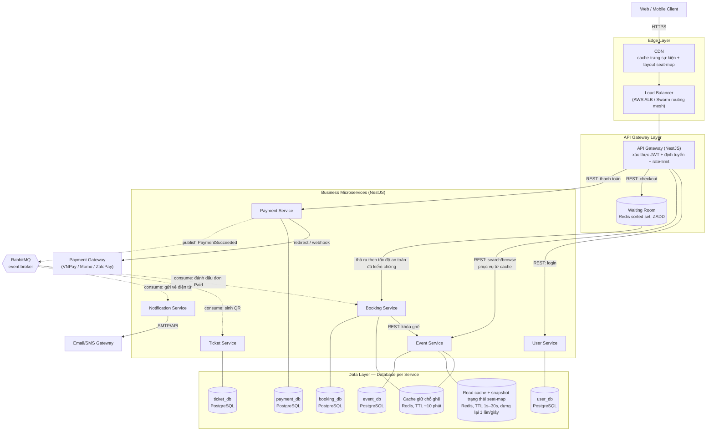
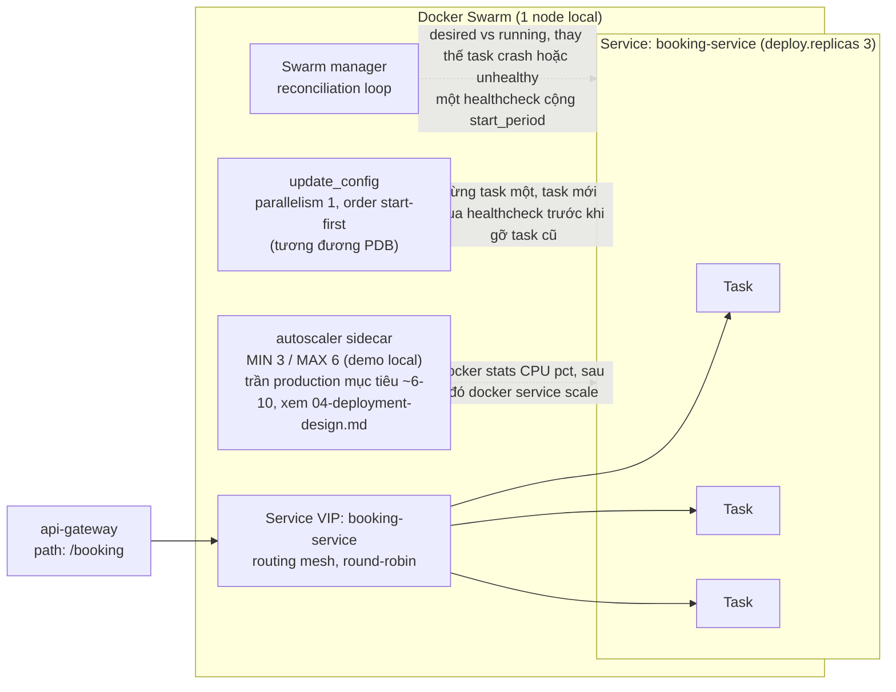

# SƠ ĐỒ HẠ TẦNG
## Hệ thống bán vé sự kiện trực tuyến (tương tự Ticketbox)

---

Các sơ đồ dưới đây được viết bằng [Mermaid](https://mermaid.js.org) — render trực tiếp trong trình xem markdown của GitHub và hầu hết editor (VS Code với extension Mermaid). Không cần công cụ ngoài; nếu cần xuất ảnh raster/PNG cho báo cáo, dán code block vào mermaid.live hoặc draw.io (File → Import from → Mermaid).

## 1. Hạ tầng tổng thể

Mũi tên liền = gọi REST đồng bộ. Mũi tên đứt = event bất đồng bộ qua message broker (Saga choreography, xem [03-system-design.md](03-system-design.md)).

## 2. Topology service Docker Swarm (theo từng service)

Cùng một mẫu áp dụng cho toàn bộ 6 service — minh họa ở đây cho `booking-service` (xem [docs/spec/swarm](swarm) để lấy stack template, và [05-project-structure-and-tech-stack.md](05-project-structure-and-tech-stack.md) để biết cách nó ánh xạ vào `infra/swarm/`).

---

*Related documents: 01-business-analysis.md, 02-use-cases.md, 03-system-design.md, 04-deployment-design.md, 05-project-structure-and-tech-stack.md, 07-database-schema.md, 08-api-contracts.md, 09-event-contracts.md, 10-sequence-diagrams.md, 11-implementation-roadmap.md*
