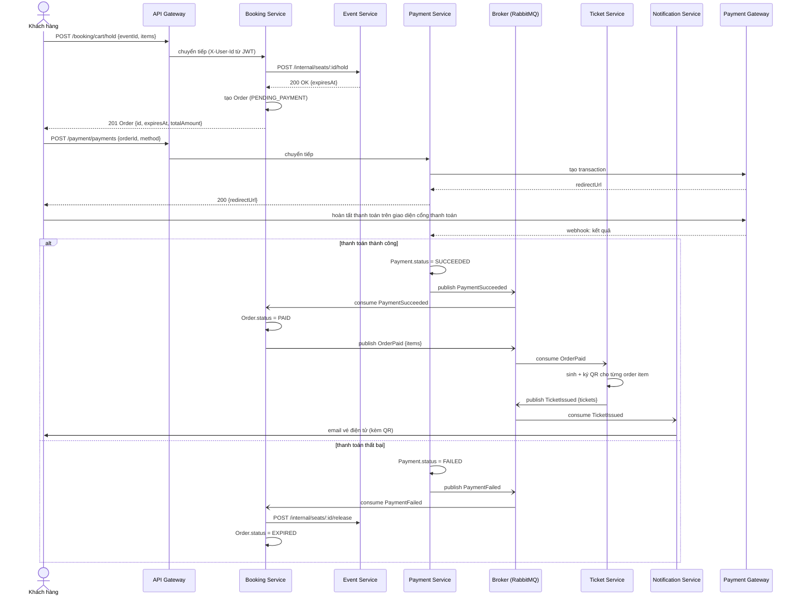
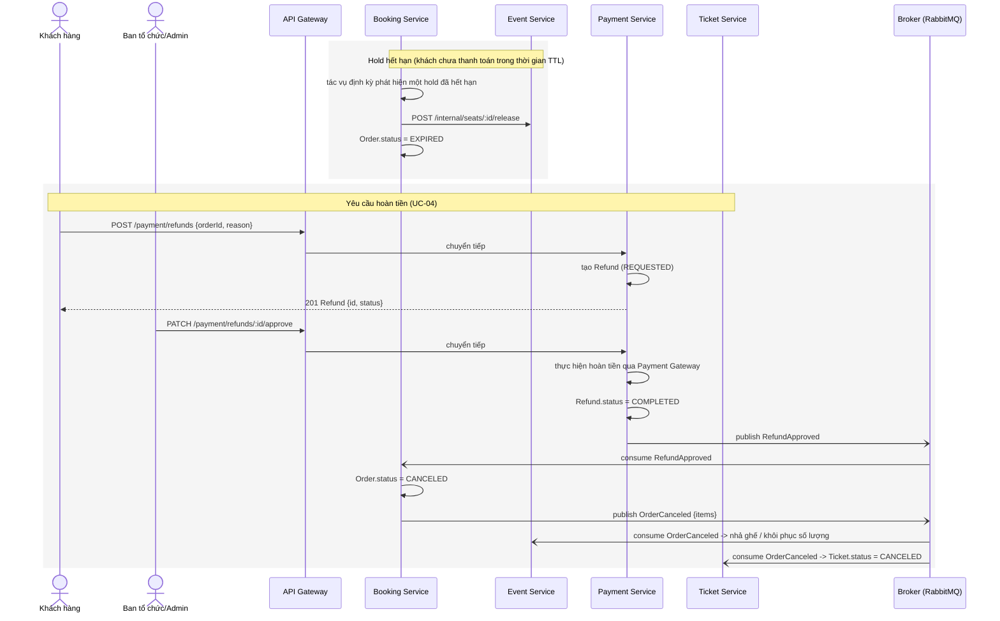
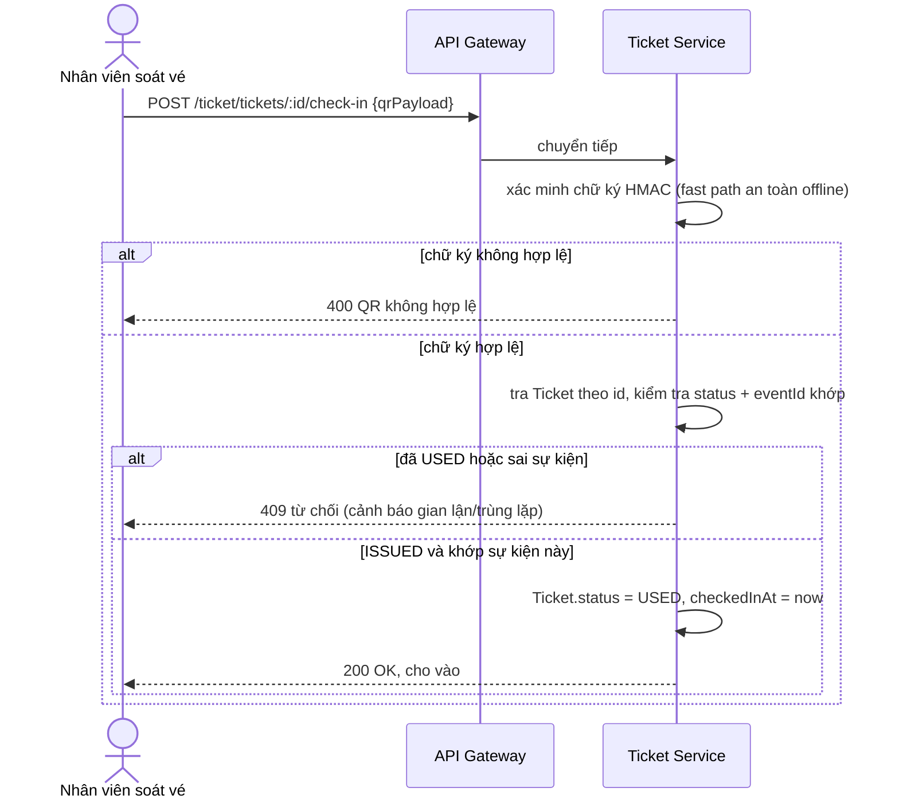

# SƠ ĐỒ TUẦN TỰ
## Hệ thống bán vé sự kiện trực tuyến (tương tự Ticketbox)

---

Minh họa Saga choreography từ [03-system-design.md](03-system-design.md) bằng các tên event cụ thể được định nghĩa trong [09-event-contracts.md](09-event-contracts.md). Được render bằng [Mermaid](https://mermaid.js.org) — giống với [06-infrastructure-diagram.md](06-infrastructure-diagram.md), hiển thị trực tiếp trên GitHub.

## 1. Đặt vé & thanh toán (UC-01, luồng thành công + thanh toán thất bại)

## 2. Hết hạn giữ chỗ & hoàn tiền (UC-04 + luồng ngoại lệ hết hạn giữ ghế)

## 3. Check-in (UC-02)

---

*Tài liệu liên quan: 01-business-analysis.md, 02-use-cases.md, 03-system-design.md, 04-deployment-design.md, 05-project-structure-and-tech-stack.md, 06-infrastructure-diagram.md, 07-database-schema.md, 08-api-contracts.md, 09-event-contracts.md, 11-implementation-roadmap.md, 12-resilience-and-failure-design.md*
