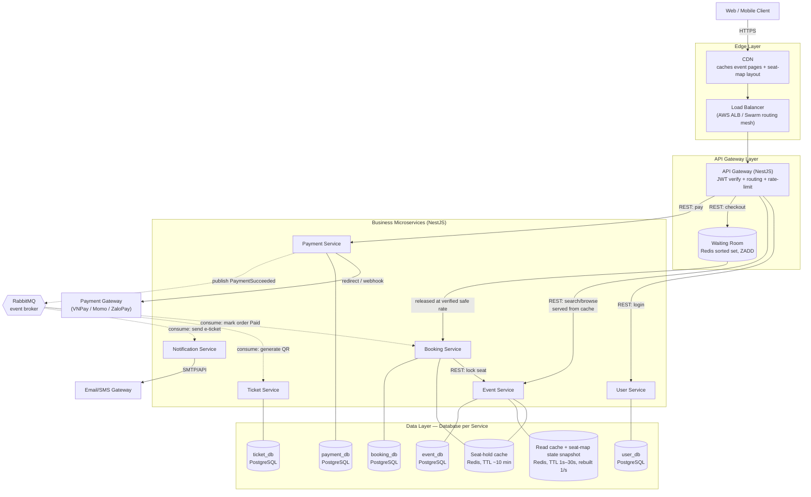
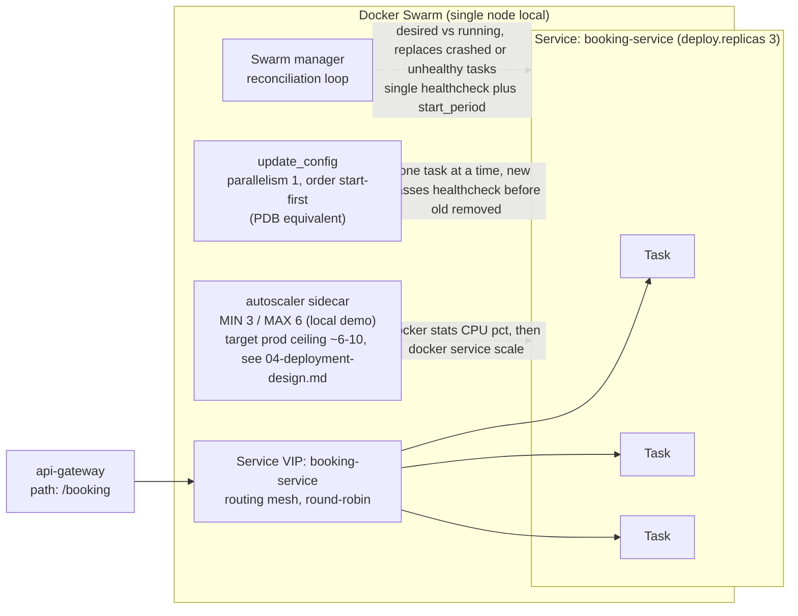

# INFRASTRUCTURE DIAGRAM
## Online Event Ticketing System (similar to Ticketbox)

---

Diagrams below are written in [Mermaid](https://mermaid.js.org) — they render natively in GitHub's markdown viewer and in most editors (VS Code with the Mermaid extension). No external tool required; if a raster/PNG export is needed for the report, paste the code block into mermaid.live or draw.io (File → Import from → Mermaid).

## 1. Overall infrastructure

Solid arrows = synchronous REST calls. Dashed arrows = asynchronous events via the message broker (Saga choreography, see [03-system-design.md](03-system-design.md)).

## 2. Docker Swarm service topology (per service)

Same pattern applies to all 6 services — shown here for `booking-service` (see [docs/spec/swarm](swarm) for the stack template, and [05-project-structure-and-tech-stack.md](05-project-structure-and-tech-stack.md) for how it maps into `infra/swarm/`).

---

*Related documents: 01-business-analysis.md, 02-use-cases.md, 03-system-design.md, 04-deployment-design.md, 05-project-structure-and-tech-stack.md, 07-database-schema.md, 08-api-contracts.md, 09-event-contracts.md, 10-sequence-diagrams.md, 11-implementation-roadmap.md*
