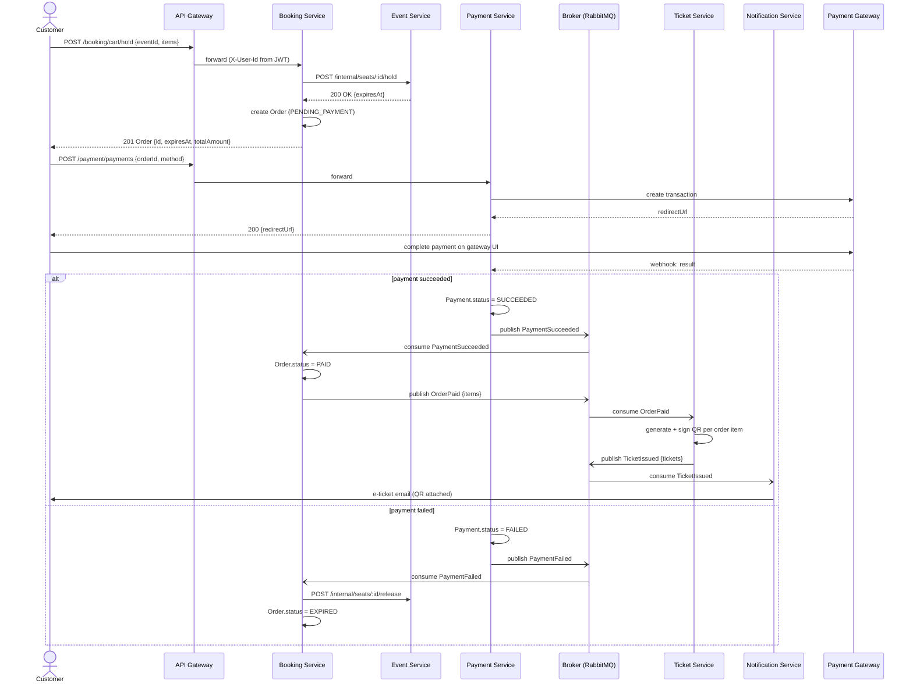
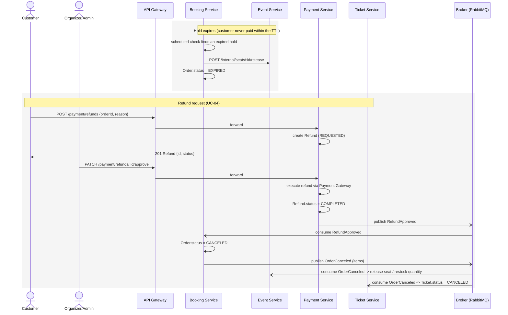
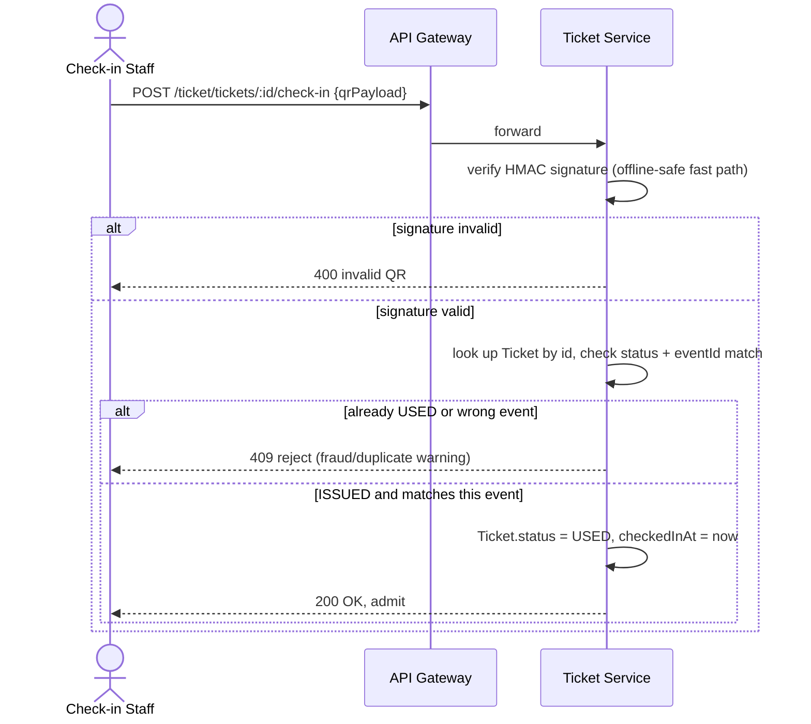

# SEQUENCE DIAGRAMS
## Online Event Ticketing System (similar to Ticketbox)

---

Visualizes the Saga choreography from [03-system-design.md](03-system-design.md) using the concrete event names defined in [09-event-contracts.md](09-event-contracts.md). Rendered with [Mermaid](https://mermaid.js.org) — same as [06-infrastructure-diagram.md](06-infrastructure-diagram.md), renders natively on GitHub.

## 1. Booking & payment (UC-01, happy path + payment failure)

## 2. Hold expiry & refund (UC-04 + the seat-timeout exception flow)

## 3. Check-in (UC-02)

---

*Related documents: 01-business-analysis.md, 02-use-cases.md, 03-system-design.md, 04-deployment-design.md, 05-project-structure-and-tech-stack.md, 06-infrastructure-diagram.md, 07-database-schema.md, 08-api-contracts.md, 09-event-contracts.md, 11-implementation-roadmap.md*
